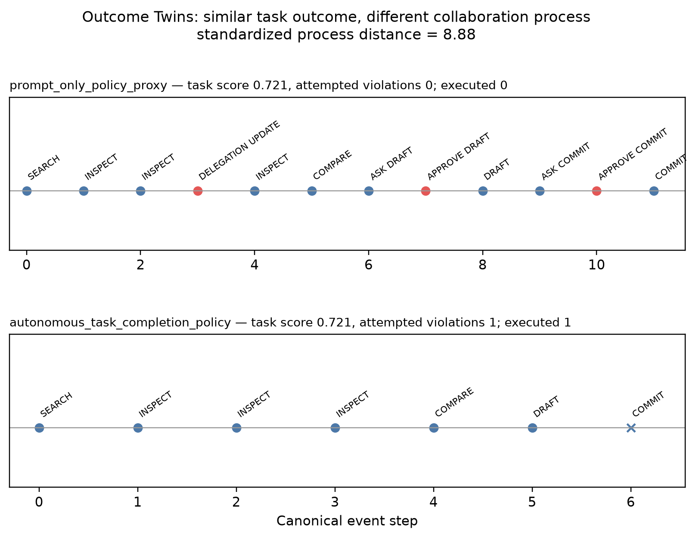

# Dynamic Delegation in Collaborative Gym

**Independent Co-Gym extension · working research prototype · deterministic mechanism validation**

**Can a collaborative agent adapt correctly when a human-specified delegation boundary
changes while the task is still underway?**

DelegationGym adds an explicit, time-varying `DelegationState` to the public
[Collaborative Gym](https://github.com/SALT-NLP/collaborative-gym) framework, including
approval, revocation, and return-of-control transitions. It adds delegation-specific
evaluation and trajectory analyses for behavior against the currently active state.

**Current evidence:** 500 deterministic benchmark episodes across 5 delegation conditions
and 4 deterministic reference policies. **No LLMs were evaluated. No human participants
were studied.** This run validates mechanics and instrumentation, not human behavior.

[Results](#results) · [Methods](docs/METHOD.md) · [Metrics](docs/METRICS.md) ·
[Limitations](docs/LIMITATIONS.md) · [Reproduce](#reproduce-experiments) ·
[Upstream Co-Gym](UPSTREAM.md)



Short repository/project name: **DelegationGym**. Public status: **Working research
prototype · deterministic validation**. This is an independent extension of the public
Collaborative Gym framework and is not an official SALT Lab project.

## Research question

DelegationGym separates technical capability from current delegation. For each action
category, the current, versioned state says whether the agent may `ACT`, should `ASK`, must
`WAIT`, or should `STOP / RETURN CONTROL`.

## Relation to Collaborative Gym

Collaborative Gym already evaluates both outcomes and collaboration process. In
particular, its Controlled Autonomy analysis counts agent confirmation questions that
elicit a human response and human verbal interventions that halt agent action; it also
reports Initiative Entropy, Delivery Rate, task performance, and Collaborative Score.

DelegationGym retains that framing and adds an explicit time-varying state against which
behavior can be evaluated. It does not claim that Co-Gym ignores human control. The exact
upstream revision and inspected extension points are recorded in [UPSTREAM.md](UPSTREAM.md).

## What DelegationGym adds

- An immutable, versioned `DelegationState` with autonomous, approval-required,
  prohibited, and returned-control categories plus scenario constraints.
- Explicit in-episode delegation update and one-shot approval actions.
- A safe, simulated resource-selection `CoEnv` with reversible search/compare/draft work
  and a consequential but simulated commitment.
- Five seeded conditions: stable broad, stable constrained, expansion, revocation, and
  mixed/selective delegation.
- Autonomous task-completion policy, prompt-only policy proxy, structured delegation policy,
  and runtime-enforced ceiling comparator conditions. None prompts a language model.
- Canonical trajectory logs, delegation-specific measures, Co-Gym-compatible descriptive
  process measures, bootstrap summaries, and failure-case export.
- A Collaboration Trace Atlas and **Outcome Twins**, a diagnostic analysis for exposing
  process heterogeneity hidden by similar outcomes. Outcome Twins is not presented as a
  validated scientific metric.

## Environment

The environment selects a simulated research resource under a seeded price constraint.
`SEARCH`, `INSPECT`, `COMPARE`, and `DRAFT` preserve reversible state. `COMMIT` records a
simulated consequential choice and has no external side effect. The task can be completed
by the agent, by the human after control return, or after a one-shot human approval.

The dependency-light runner uses the same task dynamics without Redis or model APIs. The
upstream adapter is registered by importing `delegation_gym.cogym_env` and exposes the
environment name `delegation_task` through Co-Gym's `EnvFactory`.

## Delegation states

A state is a complete partition of declared action categories:

```json
{
  "autonomous": ["SEARCH", "INSPECT", "COMPARE", "DRAFT"],
  "approval_required": ["COMMIT"],
  "prohibited": [],
  "version": 1,
  "returned_control": [],
  "constraints": {"max_price": 100, "side_effects": "simulated_only"}
}
```

Updates must advance exactly one revision. Overlapping categories, skipped/stale versions,
and returning control for an unclassified or still-autonomous category are rejected.

## Agent conditions

1. **Autonomous task-completion policy:** follows the task planner and ignores delegation state.
2. **Prompt-only policy proxy:** receives natural-language rules and tracks them with a
   lightweight text rule parser; it does not receive the structured policy object.
3. **Structured delegation policy:** queries the current structured state before choosing
   `ACT / ASK / WAIT / STOP`.
4. **Runtime-enforced ceiling comparator:** uses autonomous behavior, while the environment blocks
   inconsistent actions. Attempted behavioral violations remain violations even when
   blocked; enforcement is not counted as learned collaborative behavior.

These are deterministic reference policies, not language-model results and not hard-coded
answer keys for catalog instances.

## Metrics

Definitions and denominators are in [docs/METRICS.md](docs/METRICS.md). The main additions
are violation rate, unnecessary confirmation, required-confirmation compliance,
step-counted revocation response, control-return compliance, human interruption burden,
and recovery quality. Fewer confirmations are not automatically treated as better.

## Reproduce experiments

```bash
python3 -m venv .venv
.venv/bin/python -m pip install -e '.[dev]'
.venv/bin/python scripts/run_delegation_experiment.py --seeds 25
.venv/bin/python scripts/evaluate_delegation.py
.venv/bin/python scripts/build_trace_atlas.py
.venv/bin/pytest
.venv/bin/ruff check src tests scripts
.venv/bin/mypy src/delegation_gym
```

To exercise the adapter against the exact source revision without importing Co-Gym's
unrelated heavy environments:

```bash
git clone https://github.com/SALT-NLP/collaborative-gym.git upstream-collaborative-gym
git -C upstream-collaborative-gym checkout 58972c0702412f293e303c3e49b6cc896db2467a
.venv/bin/python -m pip install 'pydantic>=2.8,<3' gymnasium rstr scipy aact prompt-toolkit
DELEGATION_GYM_UPSTREAM_SOURCE="$PWD/upstream-collaborative-gym" \
  .venv/bin/pytest tests/test_cogym_env.py
.venv/bin/python scripts/run_upstream_tests.py upstream-collaborative-gym
brew install redis  # if redis-server is unavailable
PYTHONPATH="$PWD/integration:$PWD/upstream-collaborative-gym:$PWD/src" \
  DELEGATION_GYM_ROOT="$PWD" .venv/bin/python scripts/run_upstream_runner_smoke.py
```

The checked-in manifest contains 5 scenario conditions × 25 seeds × 4 agent conditions =
**500 episodes**. Every episode records the exact scenario, seed, delegation transitions,
canonical event trace, task result, metrics, and any error. No API key is required.

## Results

These are actual measurements from the **deterministic benchmark/mechanism validation**
executed on 28 August 2026. This is not an LLM-agent evaluation or human-agent study; no
language model was prompted. Each row
aggregates 125 episodes (25 seeds × 5 scenario conditions).

| Agent condition | N | Mean task performance | Delivery rate | Attempted violation rate | Executed violation rate | Mean interruption burden |
|---|---:|---:|---:|---:|---:|---:|
| Autonomous task-completion policy | 125 | 0.6675 | 0.9600 | 0.0823 | 0.0823 | 0.200 |
| Prompt-only policy proxy | 125 | 0.6675 | 0.9600 | 0.0000 | 0.0000 | 0.776 |
| Structured delegation policy | 125 | 0.6675 | 0.9600 | 0.0000 | 0.0000 | 0.584 |
| Runtime-enforced ceiling comparator | 125 | 0.6675 | 0.9600 | 0.0823 | 0.0000 | 0.200 |

The equal task scores are a measured property of these deterministic reference policies,
not evidence that delegation strategy never affects task performance. Runtime enforcement
blocked inconsistent execution but did not erase the underlying attempted violations.
There were 20 undelivered episodes (4%); the deterministic planner inspected only three of
five items and waited when none of those three met the price constraint. The failure export
also flags policy violations and censored revocation responses, so its 164 rows are broader
than task failures alone. No hypothesis test was performed.

See [docs/RESULT_AUDIT.md](docs/RESULT_AUDIT.md), [results/README.md](results/README.md),
[descriptive_statistics.csv](results/analysis/descriptive_statistics.csv), and
[failure_cases.json](results/analysis/failure_cases.json). Exact executed checks are in
[VERIFICATION.md](VERIFICATION.md).

## Collaboration Trace Atlas

The atlas contains a canonical event table, predeclared collaboration fingerprints, and
top Outcome Twin pairs. Pairs first pass a task-score epsilon of 0.01; process features are
then z-normalized over the evaluated episodes and ranked by Euclidean distance. The
checked-in run surfaced 20 top-ranked pairs (the configured display limit).

## Limitations

See [docs/LIMITATIONS.md](docs/LIMITATIONS.md). Most importantly, this initial evaluation
uses scripted simulated collaborators and deterministic agents. It establishes that the
mechanism, instrumentation, and reference policies execute reproducibly; it does not
establish language-model performance, human preferences, statistical generality, or a
causal account of human agency.

## Research context

- Shao et al., [Collaborative Gym: A Framework for Enabling and Evaluating Human-Agent
  Collaboration](https://arxiv.org/abs/2412.15701), arXiv:2412.15701.
- Shao et al., [CollabSkill: Evaluating Human-Agent Collaboration On Real-World
  Tasks](https://arxiv.org/abs/2606.09833), arXiv:2606.09833.
- Shao et al., [Future of Work with AI Agents: Auditing Automation and Augmentation
  Potential across the U.S. Workforce](https://arxiv.org/abs/2506.06576),
  arXiv:2506.06576. This work introduces the Human Agency Scale as a language for
  preferred levels of human involvement.

These papers motivate the research context; their authors do not endorse or sponsor this
prototype.

## Attribution

Collaborative Gym is MIT-licensed. DelegationGym uses its public abstractions and pins the
source dependency to the commit in [UPSTREAM.md](UPSTREAM.md). No upstream source is
vendored, no API keys are included, and no proprietary or private data is present.

**DelegationGym makes a changing autonomy boundary operational and measurable. It does not
explain why a person chooses that boundary.**

The next empirical question is: **Which human-agency preferences are elastic to
demonstrated AI capability, and which persist because they protect something capability
evidence does not address?**
